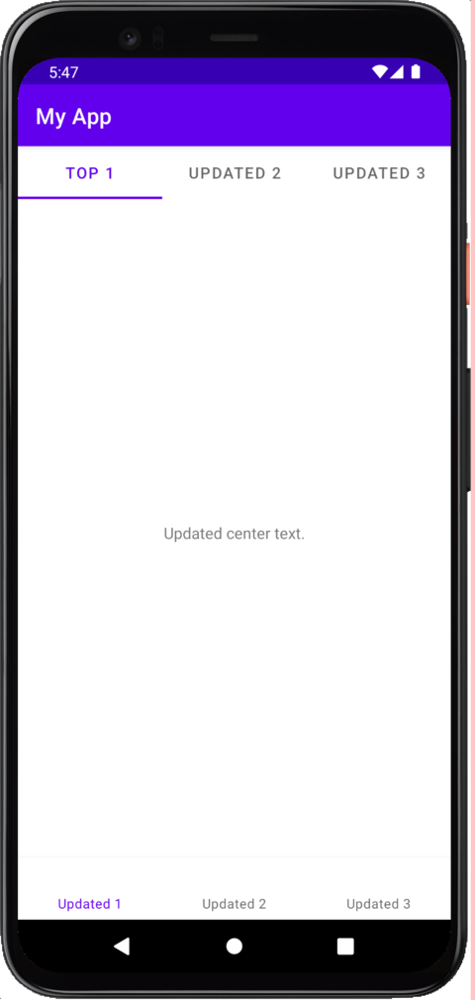
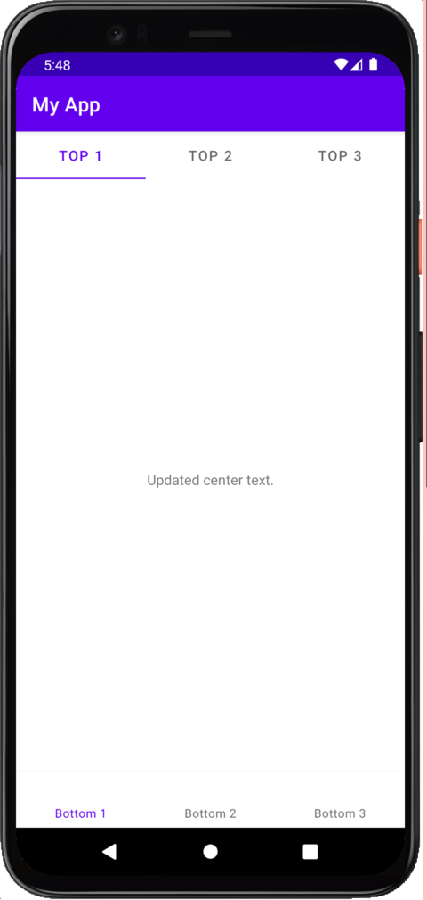
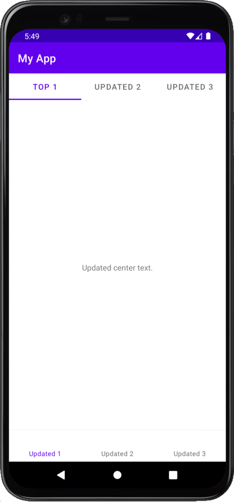

# Lokalise SDK Minification Demo

This is a demo project for the issues with the Lokalise R8 (ProGuard) rules. This project has three
build types to demonstrate the issues.

- **debug**: Simple debug build is not minified.
- **release**: Minified build that uses the recommended ProGuard rules plus the Gson rules.
- **fixed**: Minified build that uses different rules for Lokalise plus the Gson rules.

## Debug build



The debug build works more or less as expected: almost all texts are updated. Note that first tab
item is not updated but I guess that is a separate issue.

## Release build

The release build uses the recommended rules from the Lokalise docs:

```
-keep class com.lokalise.** { *; }
-dontwarn com.lokalise.*
```



The screenshot shows that these rules do not work: Lokalise only updates the normal TextView
content, while **the TabItems and BottomNavigationView contents are unchanged**. I do not understand
why this happens but maybe someone with access to the source code can figure out what is wrong.

These rules are also overly restrictive: they keep all classes in the Lokalise SDK even though that
is not necessary. This makes **the final app size larger than it should be**.

## Fixed build

It seems like there is only one rule required for the SDK to work:

```
-keepclassmembers class com.google.android.material.tabs.TabItem { <fields>; }
```

This fixes a crash when Lokalise tries to update the text in the TabItem.



The fixed build has the same results at the debug build, and also allows R8 to minify the Lokalise
SDK classes as much as possible.
